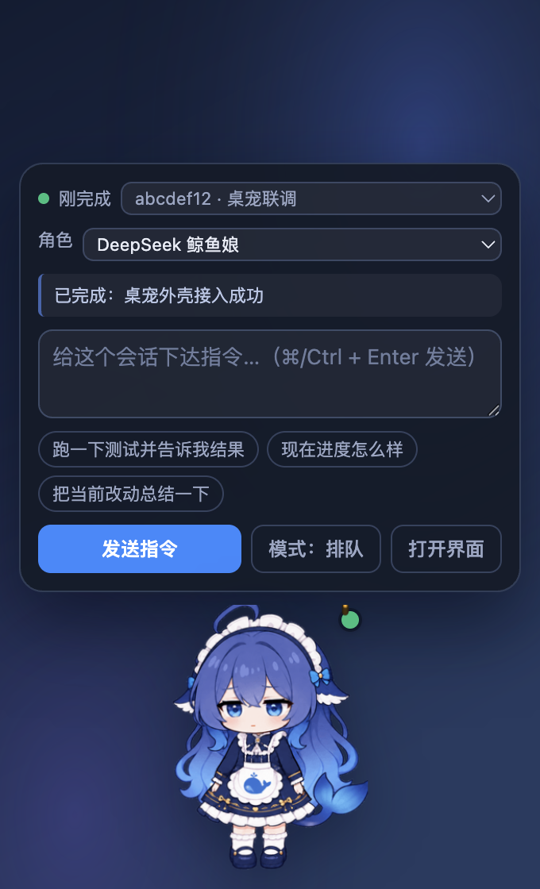
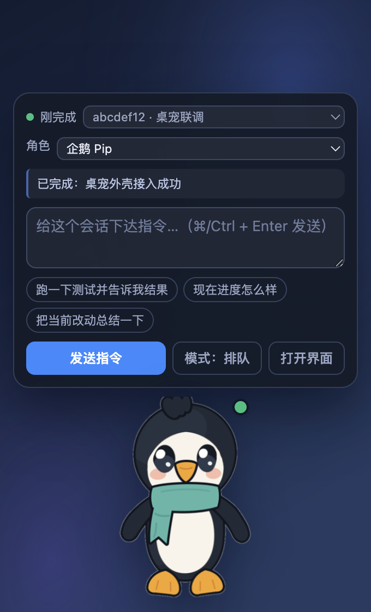

<div align="center">

# dsh-live2d-pet

**给 DeepSeek Harness 用的 Live2D 桌宠：浮在系统桌面上，看得见它在干活，点一下就能下指令。**

[](LICENSE)
[](CHANGELOG.md)
[](#测试)


&nbsp;&nbsp;


</div>

---

## 这是什么

一只角色，两种存在方式：

| | 页面内桌宠 | 系统全局桌宠 |
|---|---|---|
| **形态** | 注册进 `shell.overlay` 插槽的悬浮层 | 透明、置顶、鼠标穿透的 Electron 窗口 |
| **覆盖范围** | harness 窗口内 | 整个桌面，浮在其他应用之上 |
| **状态来源** | `useSessions` 快照 | 插件 Host 半边的回环桥（SSE 实时推送） |
| **适用** | Web GUI、官方桌面端 | 想让角色待在屏幕上、不占 harness 窗口时 |

两边**共用同一个角色引擎**，所以是同一只角色，不是两套实现。

它做三件事：

- **看着 harness**：从真实 Host 事件推出「思考中 / 调用工具 / 搁置 / 完成 / 报错」，用动作、徽标和气泡同时表达；
- **替你下指令**：点一下角色弹出气泡，把话送进选中的会话，支持排队与插话两种投递模式；
- **不碍事**：窗口默认整窗鼠标穿透，只在光标真正落在角色身上时才接管点击。

## 状态绑定

状态全部来自 harness 的真实事件，没有轮询私有接口：

| 相位 | 触发 | 桌宠表现 |
|---|---|---|
| `thinking` | `agent/status` → running | 快速上下浮动、张嘴 |
| `tool` | `session/event` `tool/call` | 气泡显示正在调用哪个工具 |
| `done` | `turn/end` completed | 跳一下，绿色徽标 |
| `error` | `turn/end` 非 completed、`agent/error` | 抖动，红色徽标 + 原因 |
| **`waiting`** | running 但 45 秒无事件 | 几乎静止、呼吸变慢、黄色徽标 |
| `idle` | 其余 | 常态呼吸 + 随机眨眼 |

`waiting`（搁置）是刻意做成“看起来就不一样”的：忙是动的，卡住是静的。完整的事件映射与可调窗口见 [`docs/ARCHITECTURE.md`](docs/ARCHITECTURE.md)。

## 快速开始

### 环境要求

- Node.js ≥ 20
- 已安装 DeepSeek Harness（`dsh` 在 `PATH` 上）
- 系统全局桌宠需要 Electron，随 `pnpm install` 装好

### 1. 页面内桌宠

```bash
git clone https://github.com/br0ny4/dsh-live2d-pet.git
cd dsh-live2d-pet
pnpm install
pnpm build

dsh plugin --profile web add ./packages/dsh-live2d-pet
```

重启 `dsh` 后，界面右下角出现桌宠。卸载：

```bash
dsh plugin --profile web remove dsh-live2d-pet
```

### 2. 系统全局桌宠

```bash
cd packages/dsh-pet-shell
pnpm start
```

外壳的接入策略是**自动选**：先找已经在跑的 harness（也就是你正在用的那个），找到就直接接上去，状态与指令都通到那些会话；找不到才自己起一个 `dsh web --port 0`。

```bash
npx electron . --attach-only        # 只接入，不自己起 harness
npx electron . --dsh /path/to/dsh   # 指定 dsh 可执行文件
npx electron . --profile web        # 指定 profile
npx electron . --dev                # 详细日志
```

托盘菜单提供连接状态、重新连接、开关桌宠、打开 Harness 界面。

## 交互

| 操作 | 结果 |
|---|---|
| 单击角色 | 打开 / 收起指令气泡 |
| 拖动角色 | 移到桌面任意位置 |
| 移动鼠标 | 角色的眼睛跟着光标 |
| `⌘/Ctrl + Enter` | 直接发送 |
| 气泡里的模式按钮 | 在「排队」（排在当前回合之后）与「插话」（打断正在执行的回合）之间切换 |

## 角色

自带两个，也接受你自己的：

|  |  |
|---|---|
| **DeepSeek 鲸鱼娘**（默认） | **企鹅 Pip**（本项目原创） |

在指令气泡的「角色」下拉框里切换。要用自己的三视图：

```bash
node scripts/character.mjs add --from ~/我的角色.png --id my-character --name "我的角色"
```

白底三视图和已抠好的透明 PNG 都吃，会自动抠图、自动绑骨，并输出一张**骨架叠图**供你核对（推导不准时可以写 `rig.overrides.json` 局部修正）。完整说明见 [`docs/CHARACTERS.md`](docs/CHARACTERS.md)。

### 它是怎么动起来的

角色是一张扁平立绘，渲染器把它当作可形变网格——骨架用椭圆区域标出头发、呆毛、鳍、裙摆、躯干、双眼、嘴，每个网格顶点按覆盖它的区域权重位移。在此之上还有一层行为：

| 行为 | 表现 |
|---|---|
| 情绪 | 思考 / 执行 / 搁置 / 完成 / 报错各自不同的体态 |
| **打盹** | 长时间待命后闭眼、呼吸变慢、飘出 `z` |
| **戳一下** | 点角色它会跳一下并冒感叹号 |
| **拖动** | 移动窗口时下半身滞后于身体 |
| **视线** | 眼睛跟随光标；没人理它时自己东张西望 |
| 徽记 | 完成冒星、报错冒汗滴，都是矢量绘制，不依赖素材 |

真 Live2D 模型是更好的答案，本项目也生产了一个：`resources/live2d/models/whale-maid/` 里有完整的 Cubism 4 模型族（`.moc3` + `.model3.json` + `.cdi3.json` + `physics3.json` + 6 秒循环待机与眨眼/点头/摇头动作 + 4096² 图集 + 可二次编辑的 `.cmo3`），由 [`live2d-pipeline/`](live2d-pipeline/README.md) 从分层 PSD 经 [psd2live](https://github.com/tsunehimatoi/psd2live) 自动绑骨导出。

**目前插件渲染的仍是网格形变**，Cubism 渲染后端尚未接入。渲染后端只需要满足四个方法，换后端不用动 UI：

```js
createCharacter(canvas, { rig, sprite }) -> {
  setMood(mood), setTalking(bool), setPointer(x, y, active), dispose()
}
```

也可以直接使用官方免费样例模型：`pnpm assets:live2d` 会从 Live2D 官方渠道下载 Cubism Core 与 8 个样例模型（Hiyori、Haru、Mao、Mark、Natori、Ren、Rice、Wanko）。这些素材不入库，理由见[许可](#许可)。

## 仓库结构

```
packages/
  dsh-live2d-pet/            插件包（可发布到 npm）
    lib/index.js               Host 半边：事件订阅 + 回环桥 + 发现文件
    src/client/pet.js          页面内桌宠：悬浮层 + 指令气泡
    src/client/engine.js       WebGL 网格形变渲染器
    test/bridge.test.mjs       Host 半边自测（34 项）
    build.mjs                  esbuild → 内联样式表与立绘
  dsh-pet-shell/             系统桌面外壳（Electron，不发布）
    src/main/index.js          窗口 / 托盘 / 接入策略
    src/main/bridge.js         发现文件 + SSE 客户端
    src/main/harness.js        查找 dsh、拉起 harness、等桥就绪
    src/renderer/pet.js        全局桌宠 UI + 逐像素命中测试
    test/smoke.mjs             端到端冒烟（9 项）
scripts/
  character.mjs             角色 CLI：list / build / add（自带三视图导入）
  lib/matte.mjs             抠图：白纸参考稿与透明图两条路
  lib/rig.mjs               自动绑骨：轮廓、双眼、喙/嘴、躯干、鳍、脚
  fetch-live2d-assets.mjs   抓取 Cubism Core 与官方样例模型
  make-penguin-art.mjs      生成原创企鹅角色的三视图
  make-doc-images.mjs       合成 README 用图
  live2d-*.sh               psd2live 构建与运行
docs/
  ARCHITECTURE.md            两层结构、桥协议、状态派生、渲染取舍
  CHARACTERS.md              角色来源、自定义导入、骨架修正
  VERSIONING.md              版本管理计划
resources/
  characters/whale-maid/     内置角色：立绘、骨架、原画
  characters/penguin/        内置角色：原创企鹅三视图
  live2d/models/whale-maid/  自产的 Cubism 4 模型
live2d-pipeline/             分层 PSD → .moc3 的生产流水线（独立 README）
```

## 开发

```bash
pnpm install
pnpm build                   # 构建插件客户端 bundle 与外壳渲染进程 bundle

# 角色
pnpm characters              # 列出全部角色
pnpm characters:build        # 重建立绘与桌宠小图（保留既有骨架）
pnpm characters:rerig        # 重新推导骨架，再核对 debug-overlay.png
node scripts/character.mjs add --from <图> --id <名>   # 导入自己的角色

# Live2D 官方素材
pnpm assets:live2d           # 下载 Cubism Core + 官方样例模型
pnpm assets:live2d:list      # 列出可下载的样例模型
```

改了插件源码后，重新 `pnpm build` 并重启 `dsh` 即可。开发外壳时可以用 `test/mock-bridge.mjs` 起一个假 harness，不必真的跑一遍：

```bash
DSH_HOME=/tmp/pet-dev node packages/dsh-pet-shell/test/mock-bridge.mjs &
DSH_HOME=/tmp/pet-dev npx electron packages/dsh-pet-shell --attach-only --dev
```

## 测试

```bash
pnpm test              # 全部 77 项断言
pnpm test:bridge       # Host 桥 41 项
pnpm test:shell        # 外壳端到端 13 项
pnpm test:model        # 模型结构 23 项
```

`test:shell` 是真正的集成测试：它拉起一个只实现三条路由的假 harness，再把**真的 Electron 外壳**跑起来接上去，校验接入日志、零渲染错误、角色加载、截图的尺寸与格式。它唯一判断不了的是角色好不好看——那需要人眼看 PNG（加 `--keep-shot` 会保留截图路径）。

渲染进程的错误会**直接判定测试失败**。这条规则不是装饰：徽记层曾经因为「WebGL 画布拿不到 2D 上下文」每帧抛异常，而界面看起来完全正常，正是这条断言把它抓出来的。

## 文档

| 文档 | 内容 |
|---|---|
| [`docs/ARCHITECTURE.md`](docs/ARCHITECTURE.md) | 两层结构的由来、harness 接入点、状态派生、桥协议规格、渲染取舍 |
| [`docs/CHARACTERS.md`](docs/CHARACTERS.md) | 角色来源、导入自己的三视图、骨架修正、角色查找顺序 |
| [`docs/VERSIONING.md`](docs/VERSIONING.md) | 版本号规则、桥协议版本、兼容性矩阵、发布流程、分支策略 |
| [`CHANGELOG.md`](CHANGELOG.md) | 变更记录 |
| [`live2d-pipeline/README.md`](live2d-pipeline/README.md) | 分层 PSD → `.moc3` 的完整生产流程与复现命令 |
| [`packages/dsh-live2d-pet/README.md`](packages/dsh-live2d-pet/README.md) | 插件包的使用与打包细节 |

## 兼容性

| 插件版本 | 最低 DSH | 宿主 | 说明 |
|---|---|---|---|
| 0.1.x | `0.1.5-rc.2` | Web GUI、官方桌面端 | 首个可用版本 |

DeepSeek Harness 目前处于预发布（`0.1.5-rc.2`），客户端插件 API 没有兼容承诺。若 harness 升级导致 `dsh.client.inject` 依赖项或插槽契约变化，插件会发 minor 版本并在上表标注新的最低版本。详见 [`docs/VERSIONING.md`](docs/VERSIONING.md)。

## 已知限制

这份清单是如实的，不是待办宣传：

- **默认角色是网格形变，不是真 Live2D**。`.moc3` 已产出并通过 23 项结构校验，但渲染后端尚未接入。
- **模型只在中性姿态下验证过像素级正确**。分层 PSD 重新合成与源图逐像素相等（`max|Δ| = 0`），但眨眼、口型、物理在真实渲染器里的表现尚未目视确认。
- **PSD 的语义标签有一部分是启发式近似**。原画没有真正的分层信息，头发前后、头饰、尾鳍、额头的切分来自几何与颜色规则；其中“发丝搭在深蓝衣服上”那一处最弱，中性姿态看不出，让这些部件单独形变时会露馅。
- **原画没有眉毛**（被刘海完全遮住）。要做眉毛动画需要先补画。
- **换角色需要重新构建**：立绘与骨架在构建时内联进 bundle。
- **官方桌面端尚未发布安装包**。官方仓库里已有 `apps/desktop`，但 npm 上还没有包、也没有安装包。插件本身在官方桌面端里能跑（同一套客户端运行时），系统全局悬浮窗口那部分要等它放出窗口 API。

## 许可

[MIT](LICENSE)。

本仓库**不包含**以下第三方素材，它们由 `pnpm assets:live2d` 按机器从官方渠道抓取：

- **Live2D Cubism Core** 与**官方样例模型**（Hiyori、Haru、Mao、Mark、Natori、Ren、Rice、Wanko）是株式会社 Live2D 的专有素材。按 Live2D 的许可，它们可以随应用分发，但不能作为独立文件再分发——所以由脚本按机器获取，不入库。
- **DeepSeek Harness**（`@deepseek-ai/*`）作为依赖使用，不在此仓库内。

`resources/live2d/models/whale-maid/` 是本项目自己的产出（由本仓库的原画经 psd2live 生成），随仓库分发。

<sub>项目地址：https://github.com/br0ny4/dsh-live2d-pet</sub>
